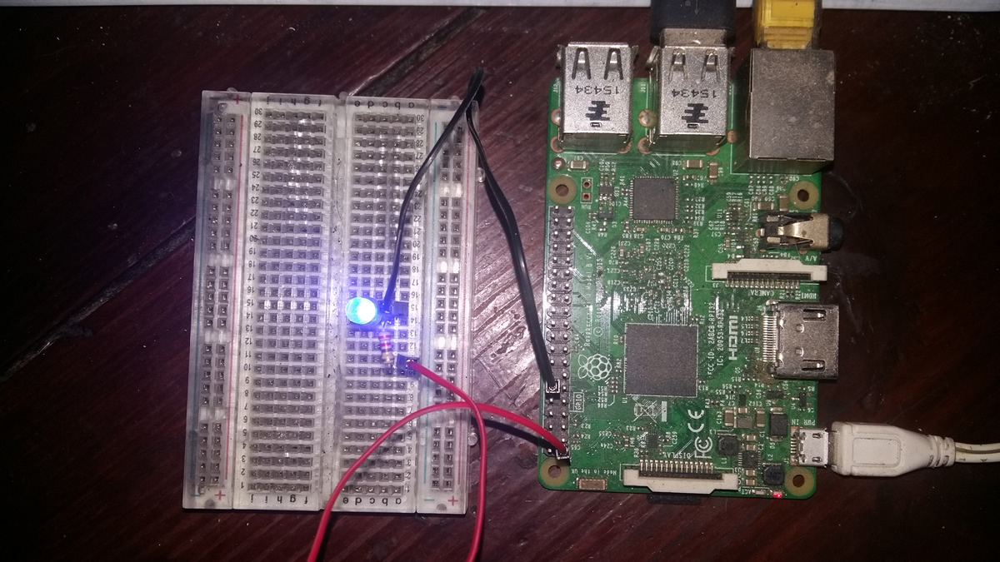

# IoT JumpWay Raspberry Pi Basic LED Example

  

## Introduction

Here you will find sample device scripts for connecting Raspberry Pi to the TechBubble Technologies IoT JumpWay using the Python MQTT Library. The codes allow you to set up a basic device that allows control of an LED. Once you understand how it works you are free to add as many actuators and sensors to your device and modify your code accordingly.

## Before You Begin

If this is the first time you have used the TechBubble IoT JumpWay in your IoT projects, you will require a developer account and some basics to be set up before you can start creating your IoT devices. Visit the following link and check out the guides that take you through registration and setting up your Location Space, Zones, Devices and Applications.

[TechBubble Technologies IoT JumpWay Developer Program (BETA) Docs](https://github.com/TechBubbleTechnologies/IoT-JumpWay-Docs/ "TechBubble Technologies IoT JumpWay Developer Program (BETA) Docs")

## Python Versions

- 2.7
- 3

## Hardware requirements

  

1. Raspberry Pi.
2. 1 x LED.
3. 1 x 220 ohm Resistor
4. 2 x Jumper Wires
5. 1 x Breadboard

## Software requirements

1. TechBubbleIoTJumpWayMQTT  
2. JSon

## Preparing Your Raspberry Pi

Take some time to ensure your Raspberry Pi firmware and packages are up to date.

- Update Raspberry Pi Firmware

```
    [root@localhost ~]# sudo rpi-update
```

- Update Raspberry Pi Trusted Certificates

```
    [root@localhost ~]# sudo apt-get install ca-certificates
```

- Update Raspberry Pi Packages

```
    [root@localhost ~]# sudo apt-get update
    
    [root@localhost ~]# sudo apt-get upgrade
    
    [root@localhost ~]# sudo apt-get dist-upgrade
```

## Install Requirements

    $ pip install --upgrade pip
    $ pip install -r requirements.txt

## Setting Up Your Raspberry Pi

  

First of all you need to connect up an LED to your Raspberry Pi. To connect the LED you will need a breadboard, a 220 ohm resistor, and two jumper wires. 

1. Place the LED on your breadboard.
2. Connect the short leg of the LED to pin 18 of your Raspberry Pi using a jumper wire.
3. Connect one end of the resistor to the long leg of your LED.
4. Connect the other end of the resistor to the 3v output of the Raspberry Pi.

## Connection Credentials & Sensor Settings

- Follow the [TechBubble Technologies IoT JumpWay Developer Program (BETA) Location Device Doc-](https://github.com/TechBubbleTechnologies/IoT-JumpWay-Docs/blob/master/4-Location-Devices.md "TechBubble Technologies IoT JumpWay Developer Program (BETA) Location Device Doc") to set up your device. 

  

- Retrieve your connection credentials and update the config.json file with your new connection  credentials and sensor setting.

```
	"Sensors": {
		"LED": {
			"ID": 0,
			"PIN": 18
		}
	}
```

```
	"IoTJumpWaySettings": {
		"SystemLocation": 0,
		"SystemZone": 0,
		"SystemDeviceID": 0,
		"SystemDeviceName" : "Your Device Name"
	}
```


```
	"IoTJumpWayMQTTSettings": {
		"host": "https://iot.techbubbletechnologies.com",
		"port": "8883",
		"username": "Your MQTT Username",
		"password": "Your MQTT Password"
	}
```


## Execute The Program

    $ sudo python/python3 Basic-Led.py 

## IoT JumpWay Raspberry Pi Examples Bugs/Issues

Please feel free to create issues for bugs and general issues you come accross whilst using the IoT JumpWay Raspberry Pi Examples. You may also use the issues area to ask for general help whilst using the IoT JumpWay Raspberry Pi Examples in your IoT projects.